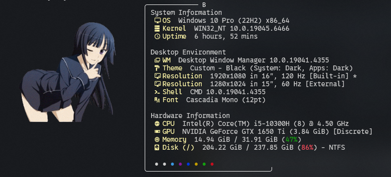

# ✨ Anime-Style Fastfetch Configuration

Hello everyone! 👋  
I present to you an **anime-style configuration file** for the **Fastfetch** utility.

---

## 🖼️ Preview

---

## 📦 Requirements

To use this configuration, you must have **Fastfetch** installed:  
🔗 [Download Fastfetch](https://github.com/fastfetch-cli/fastfetch.git)

---

## ⚙️ Installation Guide

Follow these simple steps:

1. 📥 **Download** the configuration file  
   *(filename here)*

2. 📂 Open File Explorer and navigate to:
C:/Users/{your username}/.config/fastfetch

3. 📋 **Paste** the downloaded file into this folder

4. 💻 Open Command Prompt and run:
fastfetch

---

## ✅ Done!

If everything is set up correctly, you should now see your **anime-style Fastfetch layout** 🎉

---

## 💡 Tips

- Make sure Fastfetch is added to your system PATH
- You can customize the config further to match your style

---

Enjoy your new terminal look! 💖
